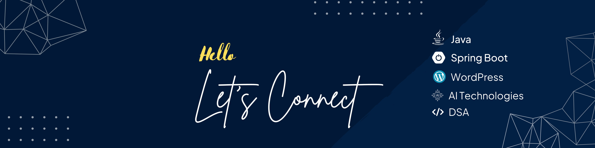

# 👋 Hi, I'm Aman Saifi  

🚀 **Aspiring Full Stack Developer** | **Full Stack Developer** | **Java & Spring Boot** | **WordPress Designer & Developer** | **Data Structures & Algorithms** | Exploring **AI/ML** in Software Development  

---

## 🔹 About Me  

🚀 Skilled in **Java backend development** using **Spring Boot**  
🌐 Experienced in **WordPress full-stack solutions** & **custom web development**  
⚡ Strong foundation in **Data Structures & Algorithms (DSA)**  
📚 Exploring **AI/ML-powered software development tools**  
🛠️ Balanced focus on **scalable systems** and **user-centric design**  

---

## 🔧 Tech Stack  

- **Languages:** Java, JavaScript, Python, PHP, SQL  
- **Backend:** Spring Boot, Hibernate, REST APIs, Spring MVC 
- **Frontend:** HTML, CSS, JavaScript, Tailwind CSS, React  
- **Database:** MySQL, PostgreSQL  
- **CMS & Tools:** WordPress Development, Elementor, Git, GitHub, VS Code, IntelliJ IDEA  
- **Other Skills:** Data Structures & Algorithms, OOPs, Operating System, DBMS, System Design basics  

---

## 🌱 What I’m Learning Next  

- **Advanced Spring Boot & Microservices**  
- **AI/ML integration in full-stack development**  
- **Scaling applications with cloud-based solutions**   

---

## 📫 Connect with Me  
- 🌐 [LinkedIn](https://www.linkedin.com/in/amannex)  
- 📱 [Instagram](https://www.instagram.com/amannex_/)  
- 💻 [GitHub](https://github.com/saifiaman)  
- 🏢 [Buiding @Markencia](https://www.markencia.com)  

---

✨ *"Code is like humor. When you have to explain it, it’s bad."*  
